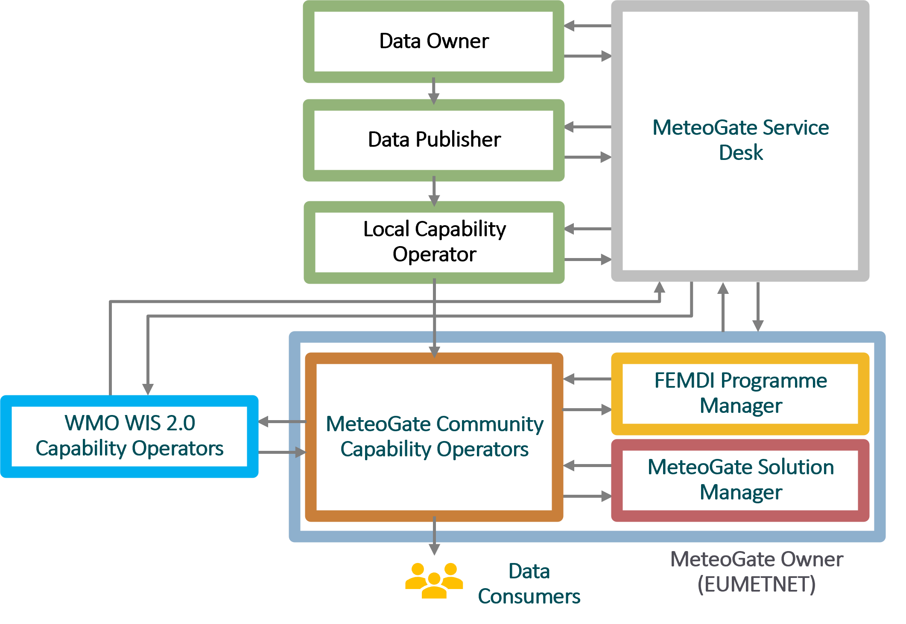

# 1. Overview

This section introduces MeteoGate and provides a high-level understanding of the system, its components, stakeholders, and usage.

---

## What is MeteoGate
MeteoGate is a ‘One-Stop Shop’ for meteorological and hydrological products and data. It provides an integrated view of all data available through MeteoGate, and the ability to access it in a simple, consistent way.
MeteoGate helps NMHSs make their data and data products discoverable and accessible while complying with:

  - WMO WIS2.0 inter-governmental agreements
  - EU’s Open Data Directive
  - EU High Value Datasets Regulation
  - National Open Data requirements

MeteoGate in an [EUMETNET](https://www.eumetnet.eu/) Programme.  Delivery responsibility is delegated to a Member who will act as the Programme Manager.

---

## MeteoGate System Overview  
MeteoGate helps organisations and people share weather and water data within Europe and worldwide.
MeteoGate provides technical infrastructure, underpinned by policies, standards, and processes, which enable data to be discovered and accessed in one place. It follows rules set by the WMO and the data owners, letting people share data without changing who owns it. 
Developed and operated by [EUMETNET](https://www.eumetnet.eu/), MeteoGate lets European National Meteorological Services openly share their hydrological and meteorological data and information.  

**MeteoGate Data Explorer** lets users discover data through search, browse and preview functionalities. It provides URLs for setting up routine access to data as well as for subscribing to data updates from the WIS 2.0 Global Broker.

**MeteoGate API Gateway** for data access is made up of two key parts:

  - API Management provides the interface between data consumers and local data stores. Once checks are completed it passes valid requests to Members.
  - Identity & Access Manager carries out checks, making sure that access policies are being followed and quality of service maintained.

Currently, there is an API Gateway running on the [European Weather Cloud](https://www.europeanweather.cloud/). In the future, additional instances can be offered from public cloud platforms, if required.

**The Data Supply** (also called WIS 2 Node) is a local component operated by each National Meteorological and Hydrological Service (NMHS) or as a centralised service (for High-Value Datasets). It is responsible for exposing data, managing metadata, and publishing notifications in line with WIS 2.0 requirements. Data Supply components:

  - Serve data collections via standard APIs (e.g. OGC API - EDR),
  - Generate and publish discovery metadata and provenance metadata,
  - Send update notifications via a Local Broker to the WIS 2.0 Global Broker.

In MeteoGate, there are two main types of Data Supply components. The first are centrally operated HVD Services, which provide access to EU High-Value Datasets such as E-SOH (land-based surface observations), radar data, and climate datasets. The second type consists of locally maintained Data Supplies operated by (NMHSs).

In addition, the **Insights Service** provides shared monitoring and analytics capabilities across the system. It collects usage statistics, performance metrics, and operational health data from core components such as the API Gateway.

MeteoGate builds on the following [WMO WIS 2.0](https://community.wmo.int/en/activity-areas/wis) components:

  - **Global Discovery Catalogue** lists and describes data assets and data collections, indexed, linked, and searchable to support data discovery and usage. It will only provide a basic interface to find data aimed at developers.
  - **Global Broker** provides a subscription service for notifications about the updates to both discovery metadata and the data.

### Data Access Levels

When using the MeteoGate API Gateway, Data Consumers have three access levels, determined by the Data Owner and Data Publisher:

  1.	Unauthenticated access: Open to anonymous users.
  2.	Authenticated access: Requires registration, offering higher Quality of Service and additional data as decided by the Data Owner.
  3.	EUMETNET Members: Restricted to EUMETNET Members.

Additional access levels may be added in the future.

---

## MeteoGate Stakeholders 

This section describes MeteoGate stakeholders and their mutual interaction.

### Governance
 
MeteoGate is run by a Programme at EUMETNET, called FEMDI, with responsibility for delivery delegated to a EUMETNET Member as the ‘Programme Manager’.

  - **MeteoGate Owner:** The organisation responsible for development, operation, maintenance, and funding of the MeteoGate system. EUMETNET is the owner of MeteoGate. EUMETNET Assembly will be the topmost governing body with overarching governance for strategic, technical, financial, and legal aspects of MeteoGate.
  - **FEMDI Programme Manager:** This role sits within the Coordinating Member, which has delegated authority from the MeteoGate Owner for the operation of the whole of the FEMDI Programme. The Coordinating Member is a Member of EUMETNET, selected through a robust bidding and assessment process. This organisation will coordinate and govern the FEMDI Programme.
  - **MeteoGate Solution Manager:** This role oversees and coordinates the operation and maintenance of the MeteoGate solution. This encompasses Community Components, as well as integrations to Data Supply Components and WMO WIS 2.0 Components. The Solution Manager sits within the Coordinating Member or other agreed 
  - **MeteoGate Service Desk** is the one point of contact for MeteoGate stakeholders and acts as first-level support. The Service Desk coordinates with other parties to fulfil user requests and solve incidents.
  - **FEMDI Expert Team:** A team of experts providing technical and policy recommendations and support to the MeteoGate Programme Manager and Solution Manager. The membership is open to EUMETNET Members, with observers from other organisations as appropriate.

### Community Component Roles

  -	**MeteoGate Community Capability Operators**: Provide, operate, and maintain the infrastructure to allow for data to be discovered and shared through MeteoGate. They provide support services and manage access to the services they are responsible for. Community Capability Operators are selected from EUMETNET Members, ECMWF and EUMETSAT using standard EUMETNET processes.
  -	**Dependency on: WMO WIS 2.0 Capability Operator**: Provides and operates the common infrastructure for the WIS 2.0 system. There are Local capability operators that operate a WMO WIS 2.0 compliant Data Supply Component. In addition, there are Global capability operators that operate shared WMO 2.0 components, some of which are also used in MeteoGate.

### Data Supply Roles

  -	**Data Owner:** Maintains the authority to decide how their data can be used through rights, obligations, terms, and conditions. They are typically EUMETNET Members.
  -	**Data Publisher:** Collects and shares data using MeteoGate. This role may be the Data Owner as well, or act on behalf of another Data Owner. They are typically EUMETNET Members.
  -	**Local Capability Operator:** Provides and operates a Data Supply Capability which integrates with the MeteoGate Community capabilities. They will provide support services and manage access to the services they are responsible for. They will also have technical mechanisms to ensure others are compliant with MeteoGate. Local Capability Operator can be the same party as Data Owner and/or Data Publisher. They are typically EUMETNET Members. 
  -	**Data Consumer:** The individual or organisation that accesses shared data through MeteoGate and utilises it. Data Consumers include, for example, NMHSs, public and private sector organisations, research institutions, and citizens.
  -	**Third-Party Data Publisher:** A Data Publisher that shares data through MeteoGate but are not EUMETNET Members (for example, private companies).

The interaction of the stakeholders is shown in the following diagram.

---

## High-Level End-to-End Process

This section describes the high-level ‘data publication to access’ end-to-end process. It describes the flow from publishing to utilising data through MeteoGate. It includes roles and activities involved in the process. The process is described in the following diagram. Each of the activities is subsequently discussed.

i.  **Create Data**: In its operations, the Data Owner creates or updates data (for example, observations from automated weather stations or weather model data) in its applications.
  
ii.	**Publish data**: The Data Publisher:

  - Collects the data (manually or automatically) and publishes it on its Data Supply component either
    - as an addition to an existing dataset, for example, one update cycle worth of new data added to a dataset consisting of weather observations; or,
    - if the shared data forms a completely new dataset, one is created. 
  -	Updates the Collection-level metadata if required.
    -	Creates or updates the Resource-level metadata.
    -	Manually updates the Discovery metadata on the Data Supply referring to the new or updated data, if required. 

_Note_: Discovery metadata does not change often. It may change, for example, if there is a fundamental change in the scope of the shared data, or a change in Data Publisher information or data licensing. New discovery metadata also needs to be created for completely new datasets.

iii.	**Publish notification**: The Local Capability Operator publishes a notification to advertise the new discovery metadata and/or data.

iv.	**WMO re-publishes notification**: The WMO WIS 2.0 Global Broker subscribes to notifications from the Data Supply. It then re-publishes notifications about the new data and metadata to all applications which have subscribed to them.
  
v.	**Update WMO catalogue**: The WMO WIS 2.0 Global Discovery Catalogue subscribes to notifications from the Global Broker and thus gets notified of new and updated discovery metadata. When it gets notified about such a change, the Global Discovery Catalogue fetches the updated discovery metadata and updates the catalogue accordingly.
  
vi.	**Find data**: Data Consumers can be made aware about available data in various ways. They can:

  -	Subscribe to notifications from the Global Broker and be notified about updated metadata and data.
  -	Find the datasets that meet their needs using the Data Explorer by browsing or searching for datasets with specific characteristics. 
  -	Search and browse the WMO’s Global Discovery Catalogue, in cases where a summary of the available datasets is sufficient.
  -	Search via common search engines – records in the WMO Global Discovery Catalogue are indexed by the search engines enabling data consumers to find them via their favourite/normal search path.
    
vii.	**Request data**: Using information provided in the discovery metadata, the Data Consumer can:

  -	Make anonymous requests for shared data through the API Gateway. 
  -	When required by a data policy and in line with EU regulation, the API Gateway requires authentication from the user using an API Key. A Data Consumer can obtain an API Key by registering to MeteoGate using a trusted Third-Party Identity Provider. 
  -	Bulk download data. 

viii.	**Proxied access**: The API Gateway proxies access to connected Data Supply services. The user can then utilise the data in their own applications. 

> ℹ️ **Note:** Using the API Gateway is optional for the Data Publisher. They can also publish the data directly from the Data Supply (for example, if the dataset is very large or if the Data Publisher already has API Management implemented as part of their Data Supply capability).

  ix.	**Insights service**: Community Capability Operators and other stakeholders can use the Insights service in the API Gateway to monitor data discovery and use. For example, they can observe how the data is passing through the system to be able to address any issues.

---

## Data Quality
MeteoGate is responsible for the common data sharing infrastructure but does not specify data quality. Data Owners and Data Publishers are responsible for ensuring data quality.
However, Data Owners that are WMO members still need to fulfil WHO data quality requirements.

> [to be updated if required]

---

## Quality of Service

MeteoGate is committed to ensuring a high-quality user experience across its components and services. The concept of Quality of Service (QoS) in MeteoGate refers to measurable and agreed-upon service levels that apply to both Community and Local Components.

Quality of Service aspects cover:

- **Availability**: Ensuring API Gateways, Developer Portals, and Data Explorer remain operational with high uptime.
- **Performance**: Data access endpoints should return responses within acceptable timeframes, even under load.
- **Scalability**: System components are designed to handle varying data volumes and request loads without degradation.
- **Support and incident response**: MeteoGate provides centralised support through the Service Desk and follows defined escalation procedures.
- **Monitoring and metrics**: Usage statistics and performance data are collected through the Insights Service to proactively identify issues.
- **Service differentiation**: Authenticated users and EUMETNET Member users may receive enhanced QoS, including higher rate limits or data prioritisation.

Minimum acceptable service levels for MeteoGate components are described in the **Quality of Service Policy**.

> [to be updated if required]

