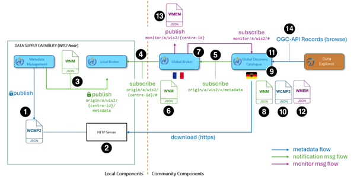

# 3. Publishing Data

This section describes how to publish open meteorological and hydrological data through MeteoGate, ensuring compliance with EU High-Value Datasets (HVD) regulations and WMO WIS 2.0 obligations.  

These instructions are intended for **NMHSs** and other entities publishing data via MeteoGate, referred to as **Data Publishers** in MeteoGate.

## What is a Data Supply?

In MeteoGate, a **Data Supply** is the technical component used to share, manage, and publish data and metadata. It enables:

  - Data storage
  - API-based access
  - Data processing in line with regulations
  - Metadata management for discovery
  - Notification services to the WMO WIS2 components

A **Data Publisher** deploys a Data Supply to make datasets available through MeteoGate.

More details on architecture and integration options can be found in the [MeteoGate Overview](../1-overview/).

## Roles in the Data Publishing Process

The data publishing process involves several roles:

  - **Data Owners**: Define usage rights and conditions.
  - **Data Publishers**: Share data through a Data Supply and ensure compliance.
  - **Local Capability Operators**: Manage Data Supplies, provide support, enforce policy adherence.
  - **Data Consumers**: Access shared data.
  - **Community Capability Operators**: Maintain MeteoGate data discovery and sharing infrastructure.
  - **FEMDI Coordinating Member**: Oversees system-level governance.

See full description of roles and responsibilities in the [MeteoGate Overview](../1-overview/).

## Data Publishers’ Responsibilities

Data Publishers must ensure:

  - Data integrity and availability
  - Compliance with MeteoGate policies
  - Authorization from Data Owners
  - Maintenance of minimum data availability
  - Notification of disruptions
  - Incident response and support
  - Reporting to EUMETNET as required

See full policy in the [MeteoGate Participation Management Policy](../references/).

## Fulfilling EU and WMO Obligations

MeteoGate aligns with:

  - WMO WIS 2.0
  - EU Open Data policies

It integrates with:

  - WIS2 Global Broker
  - WIS2 Global Discovery Catalogue

Compliance is ensured through:

  - [EU Commission Implementing Regulation 2023/138 on High Value Datasets](http://data.europa.eu/eli/reg_impl/2023/138/oj)
  - [EU Open Data Directive (2019/1024)](http://data.europa.eu/eli/dir/2019/1024/oj)
  - [EU INSPIRE Directive (2007/2)](http://data.europa.eu/eli/dir/2007/2/oj)
  - [WMO Manual on WIS 2.0 (WMO No. 1060)](https://community.wmo.int/en/activity-areas/wis/publications/1060-vII)
  - [WMO Guide to WIS 2.0 (WMO No. 1061)](https://community.wmo.int/en/activity-areas/wis/publications/1061-vII)
  - [WMO Manual on Codes (WMO No. 306)](https://community.wmo.int/en/activity-areas/wis/publications/306-vI.2)

Recommended standards:

  - EUMETDAPS definitions for European meteorological data-sharing policies
  - Standardized vocabularies from WMO, ECMWF, EUMETNET, and EUMETSAT
  - [FAIR Principles](https://www.go-fair.org/fair-principles/) for best practices in data consistency, accuracy, and compliance

---

## Start Here – Steps to Publish Data Through MeteoGate

### Step 1: Select data publishing pattern(s) and deployment environment
The choice between using a MeteoGate HVD service, the API Gateway, or direct access affects design choices and deployment. The deployment platform – whether EWC, public cloud, or on-premises – should align with data access needs and cost considerations. Establish rate limits and potentially access control to ensure efficient resource use and fair access. 

### Step 2: Structure and Prepare Data

Data must be structured into well-organised datasets and collections, ensuring compatibility with MeteoGate and WMO standards. High data quality is essential, and discovery metadata must be created to enable searchability in MeteoGate, WMO WIS2, and external search engines. 

### Step 3: Deploy and Integrate Data Supply  

The Data Supply must be deployed according to the chosen publishing pattern. This involves setting up and validating API endpoints, publishing metadata and notifications, and ensuring security, scalability, and compliance.

### Step 4: Onboard Data Supply  

Once ready, Data Publishers must onboard the Data Supply with MeteoGate and WIS2 components. 

---

## Step 1: Select Data Publishing Pattern 

The Data Publisher and/or Data Owner will decide how they want their data to be made available. Data can be published through MeteoGate in three different patterns. The choice should be based on the data type, existing technical solutions and runtime environments already used for sharing open data (if any), and specific requirements for access control, cost, and performance. Data Publishers and/or Owners can choose different options for different datasets and APIs. 

The publishing pattern must be selected before designing the Data Supply and APIs as it influences design choices. All options will need MeteoGate-compliant metadata and notifications to be shared to WMO WIS2 (See registering a WIS2 Node). 

### Pattern 1: Using a MeteoGate HVD Service 

Data Publishers integrate their Data Supply components to a MeteoGate HVD service provided by EUMETNET, which proxies and/or standardizes the data before making it available through the MeteoGate API Gateway. 

EUMETNET currently has the following HVD services available:  

  - [Land-based surface observations](https://api.meteogate.eu/eu-eumetnet-surface-observations) (E-SOH)  
  - [EUMETNET OPERA weather radar](https://api.meteogate.eu/documentation/eu-eumetnet-weather-radar)   
  - [EUMETNET Climate Aggregator](https://github.com/EUMETNET/ogc-edr-workshop) 
  - [EUMETNET Warnings API](https://meteoalarm.org/en/live/page/redistribution-hub#list)

ℹ️ ***Note:*** Check specific integration requirements and instructions from the respective HVD service links.

This pattern is appropriate for the following situations​: 

  - When providing data types already supported by an existing HVD service (e.g., climate, radar, land-based surface observations). 
  - Want to leverage standardized, centrally managed services for making data available to MeteoGate. 
  - Want to ensure alignment with EU High-Value Dataset (HVD) regulations by using a pre-established, compliant service. 
  - Prefer minimal IT investment while ensuring the data is discoverable, accessible, and compliant with MeteoGate requirements. 
  - Want to benefit from improved security, efficiency, and cost-effectiveness, as MeteoGate handles security, rate limiting, and monitoring. 

### Pattern 2: Managed and Proxied Access Through MeteoGate API Gateway

The Data Supply component is registered with an appropriate MeteoGate API Gateway​. Currently, these are deployed on the EWC, in ECMWF and EUMETSAT runtime environments. EUMETNET Members will connect their data services via EWC irrespective of the location of their data (e.g., EWC, public cloud, on-premises).​ ​In the future, if requirements change, MeteoGate API Gateway can be implemented also on public clouds. 

The data is requested from and goes through the MeteoGate API Gateway allowing: 

  - Managed data requests and data flow e.g., authorization, access control, and rate limiting
  - Collection of insights on data requests and access​.

Read more about the MeteoGate API Gateway features on [MeteoGate Architecture](https://eumetnet.github.io/meteogate-documentation/technical-architecture).

This pattern is appropriate for the following situations​: 

  - There is no suitable HVD service for the type of data to be shared.
  - Data is hosted on EWC, or data access APIs will be hosted on EWC.
  - Prefer minimal IT investment while ensuring the data is discoverable, accessible, and compliant with MeteoGate requirements.
  - Want to benefit from improved security, efficiency, manageability, and cost-effectiveness, as MeteoGate handles security, rate limiting, and monitoring. 

### Pattern 3: Direct Access 

Data will be discoverable using MeteoGate, but it is requested and accessed directly from the Data Supply​ – not via the MeteoGate API Gateway​. The Data Supply and APIs are responsible for access management, rate limiting, and monitoring​. This requires more capabilities from the Data Supply, potentially making it more expensive to implement.

This pattern is appropriate for the following situations​: 

  - Data is already published through a public cloud providers’ open data initiative (e.g., Amazon Sustainability Data Initiative (ASDI), Microsoft Planetary Computer, Google Earth Engine, and Oracle Open Data). Such initiatives may cover the cost of data storage, cross-region duplication, and egress charges, thereby enabling large-scale distribution of data at low cost to the data provider – and, importantly, benefitting from the Quality-of-Service (QoS) provisions implemented by the cloud platform provider. 
  - Data is already published through a Government Data Portal​. 
  - Data or an existing API used to publish it is hosted on a public cloud (e.g. AWS, Azure, Google Cloud, or Oracle Cloud). Serving data through the MeteoGate API Gateway would be expensive due data egress costs. 
  - Large volume of data (e.g. radar or climate forecast data). 
  - High performance or availability requirements (e.g., large amount of data transferred or frequent use)​. 
  - Want to have full control of how the data is made available. 
  - Want to use fine-grained access control (e.g. for example, various groups of registered users with different QoS, paid or premium access, etc.). 
  - Want to set rate limits and quotas or allow monitoring above the capabilities offered by the MeteoGate API Gateway. 
  - Access control, request management and collection of usage metrics are already handled by a Third Party or the Data Supply/API (for example, the Data Publisher already has API Management implemented as part of the Data    Supply capability).
 
In the future, EUMETNET Members may also make use of a packaged instance of the MeteoGate API that can be deployed locally either on-premises or in a designated cloud tenancy. This will enable the Members to benefit from all necessary API Management capabilities such as rate limiting, access control, and sharing of API keys while limiting its use for only to their own datasets. 

### Choose a Suitable Platform and Understand Related Costs 

When selecting the appropriate runtime environment for publishing data through MeteoGate, Data Publishers should consider: 

  - Where their data and data access APIs are hosted (e.g., on-premises, EWC, or public cloud such as AWS, Azure, Google Cloud, or Oracle Cloud). 
  - Whether they need or want to use MeteoGate HVD services or the MeteoGate API Gateway (Data Publishing Patterns 1 or 2).

The MeteoGate API Gateway is currently deployed on EWC. There is no MeteoGate API Gateway available on any public cloud. However, currently 80 % of EUMETNET Members either do not need API Gateway protection or can be covered by the MeteoGate API Gateway on EWC. 

**Recommendations**

  - All Members providing High-Value Datasets (HVD) should connect to an appropriate HVD service or the MeteoGate API Gateway instance on EWC. 
  - If providing data or APIs that are hosted on-premises or in a public cloud, assess whether it makes sense to use HVD services, the MeteoGate API Gateway, or provide direct access. Members hosting data services on a public cloud should consider potential egress costs, as these depend on individual cloud service providers’ pricing models. Carefully evaluate whether the benefits of the MeteoGate API Gateway – such as access control, rate limiting, and monitoring – justify the additional data transfer costs. 

### Decide on Authentication and Rate Limits 

Together with the Data Owner the Data Publisher will define appropriate data access restrictions based on, for example, appropriate data policy, requirements on being able to identify users, performance and availability requirements, and the technical platform of the Data Supply and its limitations. 

Typically, the access restrictions are as follows:

  - Rate limits and quotas: Control the number of requests a user or application can make to an API within a specified time frame to prevent abuse and ensure fair usage. 
  - Authentication: Determine if the API will be open to public users or restricted to authenticated users only.

The access restrictions may be different for different datasets and APIs. Typically, it is most feasible to offer datasets sharing the same access restrictions under the same API endpoint. 

The access restrictions are implemented in different ways depending on the Data Publishing Pattern used:

  - Pattern 1: When sharing data through a HVD service, the technical access restrictions also depend on the HVD service’s agreed specifications.  
  - Pattern 2: The MeteoGate API Gateway allows setting 1) authentication (whether users need to authenticate using API Key or not to access the endpoint) and 2) rate limits (maximum number of requests per time interval) for each API endpoint. Rate limits can be set separately for authenticated and unauthenticated users, when authentication is not required (i.e. when offering better QoS to registered users). The Data Publisher can set the access restrictions for the Data Supply during the onboarding process.  
  - Pattern 3: When sharing data directly, the Data Publisher is responsible for implementing all required access restrictions.
  
---

## Step 2: Structure and Prepare Data 

Datasets should be structured in a way that ensures efficient access, consistency, interoperability, and discoverability within MeteoGate and WMO WIS2. Key aspects of structuring include defining dataset boundaries, standardizing parameters, optimizing metadata, ensuring proper indexing, and selecting suitable API technologies for data retrieval. 

MeteoGate does not enforce specific data structures or quality requirements. Data Owners and Data Publishers are responsible for ensuring that the published data is of sufficient quality. They can choose the most suitable data structures and formats based on their specific use cases, domains, and user requirements. However, MeteoGate and WIS 2 require standardized metadata and notifications for discoverability and interoperability. Also, Data Owners that are WMO members need to fulfil WMO data quality requirements. 

Data should be organised into datasets that share common characteristics, such as type (e.g., weather station observations), format, vocabulary, access protocol, quality management process, and license. 

Datasets are published as collections, which are logical groupings of related resources exposed through an API. Each collection is assigned a unique URL for accessibility. Different API technologies require different structuring approaches: 

  - [OGC API - Environmental Data Retrieval (EDR)](https://ogcapi.ogc.org/edr/) is recommended for interactive data access, enabling spatiotemporal queries and dynamic retrieval of real-time or historical observations within MeteoGate’s Data Explorer and Data Consumer applications.
  - [SpatioTemporal Asset Catalog (STAC)](https://stacspec.org/en/) is recommended for pre-packaged data, providing a standardized catalog structure for geospatial and temporal datasets, enhancing metadata discoverability and supporting large-scale archives. 

Both EDR and STAC improve data usability but serve different purposes. EDR is optimized for direct queries and interactive exploration, while STAC is suited for structured metadata-driven dataset discovery. 

**Recommendations** 

  - Ensure compatibility with API technologies such as EDR and STAC to optimize data retrieval.
  - Follow the restrictive EDR profile to maintain consistency in data structuring.
  - Use STAC for geospatial and temporal datasets to improve metadata standardization and searchability.
  - Organise datasets based on retrieval methods (e.g., real-time data, historical archives, aggregated summaries) for usability.
  - Define standardized parameters such as temperature, wind speed, and precipitation to ensure consistency across datasets and enable effective query.
  - Ensure datasets are accessible through unique URLs to support efficient discovery and retrieval.
  - Ensure compatibility with MeteoGate Data Explorer by:  
    - Including a list of available parameters (parameter_names) in the collection metadata.
    - Providing observation locations in GeoJSON format (collections/<collection_name>/locations).
    - Ensuring that data includes a time axis (domain.axes.t) for temporal queries. 
  - Optimize data indexing for fast and reliable API queries. 

### Data Formats

To ensure interoperability, usability, and performance across MeteoGate, data format should be chosen based on the type of data, the user community, and technical compatibility with MeteoGate services. 

**Recommendations** 

**1. Use an Open, Non-Proprietary Format** 

An open format allows unrestricted usage without licensing constraints, ensuring accessibility for both data producers and software developers. Open formats enhance interoperability and prevent vendor lock-in. 

**2. Choose a Format that Matches Your Data Type**

Different data structures require different formats:
  
  - Tabular data representing sets of  features (e.g., in-situ observations, station measurements)
    → Recommended formats: Comma-Separated-Variable (CSV), TSV, GeoJSON (RFC 7946), BUFR, Parquet, GeoParquet. Cloud-optimized formats like Parquet are ideal for very large datasets. 
  - Spatiotemporal coverage data (e.g., grids, multi-dimensional arrays)
    → Recommended formats: CoverageJSON, GRIB, HDF5, NetCDF (NetCDF4 as a profile of HDF5), GeoTIFF, Cloud-Optimised-GeoTIFF, Zarr. CoverageJSON is the recommended format for use with OGC API - EDR and supports efficient, standards-based access to coverage data. 
  - Overlapping cases → BUFR can encode both point-based and coverage data, but it is complex. Time-series data may be represented as a tabular list (CSV, Parque) or a one-dimensional array (NetCDF), Zarr.

**3. Select a Format that Your User Community Understands** 

The best format depends on who will use the data:

  - For WMO members and meteorological agencies, GRIB and BUFR are well-established. 
  - For broader public use and data science applications, choose widely adopted formats like GeoJSON, CSV, and GeoTIFF. 
  - For multidisciplinary scientific research, formats like NetCDF (CF-NetCDF), HDF5, and Zarr provide enhanced compatibility with analysis tools. 

If serving multiple user groups, consider offering data in multiple formats. Additionally, some formats have domain-specific profiles (e.g., CF-NetCDF for atmospheric and oceanographic sciences), so be clear on which profile or convention is being used. 

**4. Ensure Compatibility with MeteoGate and WIS2** 

To maximize usability and compliance with MeteoGate API Gateway and Data Explorer, HVD services, and WIS2, Data Publishers should:

  - Use XML, HTML, and JSON formats. Currently, the MeteoGate API Gateway primarily supports these formats, and they are recommended for API-based data access. However, other formats may be necessary depending on the dataset type and intended use case.
  - Use CoverageJSON for APIs based on OGC API - EDR, especially when integration with MeteoGate Data Explorer is expected.
  - Provide GeoJSON for vector data and spatial metadata.
  - For HVD data, follow the requirements in MeteoGate HVD service documentation. _<link?>_
  - For WMO data, follow Manual on Codes (WMO No. 306) for standardized formats. _<link?>_

### Naming Conventions 

Naming conventions should follow standard practices to provide a clear and logical structure for users and comply with international standards. 

**Recommendations** 

  - Ensure names are human-readable and self-describing. 
  - Ensure names are aligned with relevant vocabularies and OGC standards, including the restrictive EDR profile. Where applicable, use WMO, ECMWF, EUMETNET, EUMETSAT vocabularies, which define standardized terminology and 
  metadata for atmospheric and climate data. 
  - Use lowercase and hyphenated naming for all endpoints, resources, and parameters. 
  - Follow plural nouns for collections and singular nouns for individual resources. 
  - Maintain consistency in naming conventions between all your APIs. 
  - Learn from good examples to maintain consistency across all APIs within MeteoGate. 

### License 

The Data Owner should make sure that all data published via MeteoGate have a well-defined license that specifies usage rights, restrictions, and attribution requirements.  

**Recommendations**

  - Make sure that your data is licenced at an adequate level. Choose an appropriate open data license based on the intended use and distribution model, such as CC BY 4.0 for attribution-required use or CC0 for public domain dedication. For High Value Data sets it is recommended to use CC BY 4 or equivalent.  
  - Include license metadata in discovery, collection and resource metadata, using standardized fields. 
  - Document the license information clearly in the API documentation and provide links to the full license text for transparency. 
  - Maintain consistency in licensing between all your APIs, collections, and datasets 
  - Learn from good examples to maintain consistency across all APIs within MeteoGate. 

### Metadata 

Data Publishers are responsible for including metadata for their datasets. Metadata should be published before the actual data is made available.  

In MeteoGate, metadata is categorized into three levels:

  - Discovery Metadata 
  - Collection Metadata 
  - Resource/File-level Metadata 

#### Discovery Metadata

Discovery metadata enables users to find and access datasets through MeteoGate’s Data Explorer, WMO WIS2 Global Discovery Catalogue, WIS2 Global Broker notifications, external search engines, and generative AI solutions. It provides a high-level description of the dataset, including title, description, keywords, and licensing information. 

Recommendations

  - Comply with WMO Core Metadata Profile (WCMP2), GeoJSON, [OGC API – Records](https://ogcapi.ogc.org/records/), and WMO-specific attributes. Refer to Appendix F of the [WIS2 Manual](https://community.wmo.int/en/activity-areas/wis/publications/1060-vII) for more details on WCMP2 compliance 
  - Clearly describe the dataset by defining its content, purpose, and scope, including data collection and processing methods. 
  - Provide essential metadata elements, such as title, author, creation date, and keywords, to improve searchability and user understanding. 
  - Ensure accuracy and consistency by maintaining a standard terminology and formatting approach. 
  - Regularly update metadata to reflect any changes in dataset scope, format, or availability. 
  - Make metadata accessible in a searchable format with clear instructions for users. 
  - Consider end-user needs by structuring metadata to support different user groups, including researchers, meteorologists, and public data consumers. 
  - Validate discovery metadata using the PYWCMP tool provided by WMO. There are also additional validation methods outlined in the [WIS2 Cookbook](https://wmo-im.github.io/wis2-cookbook/cookbook/wis2-cookbook-DRAFT.html#_validate_a_wmo_core_metadata_profile_record). 

#### Collection Metadata

Collection metadata provides essential contextual information, such as dataset structure, temporal and spatial coverage, and relationships between resources, enabling users to browse, discover, and retrieve specific resources of interest.  

Recommendations 

To align with the data structuring requirements outlined earlier, collection metadata should:

  - Clearly explain what the data represents in no more than three sentences, making it easy to understand for all users. 
  - Be available at the collection URL, ensuring direct access for Data Consumers. 
  - Include a list of available parameters (parameter_names), allowing users to understand what data is accessible within the collection. 
  - Expose observation locations in GeoJSON format (collections/<collection_name>/locations), supporting geospatial queries and visualization in MeteoGate’s Data Explorer. 
  - Contain a time axis (domain.axes.t), ensuring compatibility with spatiotemporal queries, particularly for datasets structured according to the EDR restricted profile.

#### Resource/File-Level Metadata

Resource or file-level metadata describes individual resources, such as data files, and provides essential context, such as the physical variable encoded and its units of measurement. Well-structured file-level metadata also facilitates the automatic generation of discovery and collection-level metadata. 

Metadata should clearly define key attributes to avoid misinterpretation. For example, simply stating “temperature” is insufficient – specifying whether it refers to air temperature, screen temperature, or instantaneous 2 m above-ground temperature provides the necessary precision. 

**Recommendations**

To enhance metadata clarity and usability:

  - Define contextual details, such as physical variables and measurement units. 
  - Use qualified terms linked to authoritative definitions, such as GRIB code tables or [JSON-LD](https://www.w3.org/TR/json-ld11/) mappings, to provide machine- and human-readable references.

File-level metadata can be included in various ways:

  - Embedded within the data file (e.g., CF-netCDF format). 
  - Stored in a well-known location (e.g., BUFR code tables or “companion files” such as used in the CSV-Web format). 
  - Referenced externally (e.g., linked via HTTP headers using the describedBy Link Relation type). 
  - A combination of these methods, depending on the dataset. 

Using qualified terms with unique URLs enhances metadata discoverability and interoperability. This [Linked Data](https://www.w3.org/TR/sdw-bp/#dfn-linked-data) approach enables better understanding across different formats and domains, making data more accessible and increasing its usability.

### Links

Effective linking enhances discoverability and navigation. In MeteoGate, links should be designed to work seamlessly independent of the chosen Data Publishing Pattern. This is especially important when using the MeteoGate API Gateway to expose your API as the Gateway automatically transforms URLs provided in the metadata. 

**Recommendations**

  - Do not link to MeteoGate API Gateway-specific URLs in metadata. Links should reference the original data source rather than API Gateway-specific URLs. The API Gateway will handle URL transformation. 
  - Use relative links to ensure compatibility with MeteoGate API Gateway link transformations. 
  - Implement X-Forwarded and X-Prefix Headers for correct URL resolution when using the MeteoGate API Gateway. 
  - Ensure consistent and intuitive navigation by maintaining a clear and logical link structure throughout the API. 

## Step 3: Deploy and Integrate Data Supply 

### Choosing a Deployment Framework 

Data Publishers have full flexibility in deploying Data Supply, as MeteoGate does not impose restrictions on the technology stack or deployment environment, provided it integrates successfully with MeteoGate. 

Beyond facilitating data access, Data Supply includes functionalities such as metadata management, notification services, data processing, and storage to ensure compliance with WMO WIS 2.0 and MeteoGate. 

**Recommendations** 

A free and open-source reference implementation, [WIS2 in a Box](https://community.wmo.int/en/activity-areas/wis/wis2box), is available for WIS2-compliant Data Supply and is fully compatible with MeteoGate. 
See the [WMO Manual on WIS 2.0](https://community.wmo.int/en/activity-areas/wis/publications/1060-vII) and [Guide to WIS 2.0](https://community.wmo.int/en/activity-areas/wis/publications/1061-vII) for more information on publishing data according to the WMO requirements. 

### Deploying APIs  

In addition to other Data Supply functionalities such as discovery metadata and notifications, MeteoGate-compliant APIs must be deployed. 

MeteoGate does not enforce a specific technical implementation for APIs but provides recommendations to ensure interoperability with MeteoGate components, compliance with EU Open Data and WMO WIS2 obligations, and efficiency and reliability in data access and integration.  

Existing APIs implemented with other than MeteoGate-recommended technologies can still be valid if they include the necessary metadata and notification mechanisms. 

For further API implementation guidance, refer to [OGC Developer Portal](https://developer.ogc.org), [OGC E-learning materials](https://opengeospatial.github.io/e-learning/index.html) and [OGC EDR tutorial](https://ogcapi-workshop.ogc.org/api-deep-dive/environmental-data-retrieval/), which provide documentation, tutorials, examples, and best practices for OGC API standards, including OGC API-EDR. Also, the [STAC website](https://stacspec.org/en/) provides tutorials and other developer resources.

For implementation example, refer to e.g. [FMI’s EDR API](https://api.meteogate.eu/fi-fmi/edr), [Open Radar Data API](https://api.meteogate.eu/eu-eumetnet-weather-radar) and [Surface Observations API](https://api.meteogate.eu/eu-eumetnet-surface-observations).


The [OGC EDR Workshop repository (given as part of the EUMETNET project RODEO)](https://github.com/EUMETNET/ogc-edr-workshop) contains example implementations, configuration files, and test data that demonstrate how to publish data using the OGC API - Environmental Data Retrieval (EDR) standard. It is recommended for Data Publishers looking to understand and test EDR-based APIs in a MeteoGate-compatible setup.

**Recommendations**

  - Use [OGC API - Environmental Data Retrieval (EDR)](https://ogcapi.ogc.org/edr/) for interactive APIs. Enables seamless visualisation in MeteoGate Data Explorer, integration with HVD services, and interoperability across MeteoGate users. 
  - Use the [restrictive EDR profile](https://github.com/EURODEO/rodeo-edr-profile) to ensure consistency across implementations.  
  - Use SpatioTemporal Asset Catalog (STAC) for pre-packaged data. STAC provides a standardised approach for organising and cataloguing spatiotemporal datasets, making data more discoverable and accessible. STAC API enables structured access to metadata and assets, allowing users to efficiently browse, query, and retrieve datasets. This is particularly useful for satellite data, climate archives, and other large geospatial datasets. 
  - Support RESTful API principles with resource-based URL structures and appropriate HTTP methods (GET, POST, etc.). 
  - Ensure compatibility with WMO WIS2 metadata standards (WCMP2), including embedding metadata in API responses where needed. 
  - Follow proper naming conventions. Use clear, consistent, and descriptive names for API endpoints, parameters, and resources to improve readability and usability. Align with OGC, WMO, and MeteoGate metadata standards where applicable.
  - Optimise for availability, scalability, performance, and cost. Use caching (Redis, CDNs) to reduce load, optimise database indexing for spatiotemporal data, and enable byte-range access (GRIB, COG) for efficient retrieval. Store large datasets in chunked formats (Zarr), process long-running queries asynchronously, and leverage cloud storage (S3, Azure) for auto-scaling. Apply stricter rate limiting for public cloud data and educate users on responsible API usage, including cost and CO2 impacts. 
  - Secure APIs appropriately. Implement API rate limiting and throttling to prevent abuse, DDoS attacks, and excessive traffic that could impact service availability. Use HTTPS for all API endpoints. Enforce input validation and sanitisation to mitigate injection attacks (e.g., SQL Injection, XSS). If local authentication is required, use strong authentication and authorisation methods such as API keys, OAuth 2.0, or JWT tokens. 
  - Ensure versioning and backward compatibility to prevent disruptions for users. Use URL-based versioning (e.g., /v1/resource) to prevent breaking changes. Follow semantic versioning (major.minor.patch), support multiple active versions during transitions, and clearly document deprecations with headers (Deprecation, Sunset). Maintain backward compatibility by making additive changes when possible. 
  - Enable structured logging and monitoring to track API usage and diagnose issues efficiently. 
  - Provide documentation. Create OpenAPI (Swagger) documentation for discoverability and self-describing endpoints. Provide a human- and machine-readable landing page to support AI applications and automated discovery, ensuring that key information is directly accessible on the page without requiring additional clicks. Use OpenAPI, JSON-LD, schema.org, or OGC API landing pages to structure the content.

### Publishing Discovery Metadata 

A dataset is only considered to be part of MeteoGate (and WMO WIS 2.0) once discovery metadata about it has been published into the WIS 2.0 Global Discovery Catalogue. Data Consumers can then find and use a dataset via the Data Explorer (or the Global Discovery Catalogue itself). This enables Data Consumers to identify relevant datasets based on scope, coverage, format, licensing, etc.

This section explains how you should publish discovery metadata to the Global Discovery Catalogue using your Data Supply Capability.

Here’s how it works:

  1.	Create discovery metadata for your dataset. For more information about discovery metadata, see [Discovery Metadata](#discovery-metadata).
  2.	The Global Discovery Catalogue needs to download the metadata record, so you need to publish it via an HTTP server. This may be as a simple file hosted on a web server (i.e., a static metadata record), or through an API (e.g., an OGC API - Records Web-service endpoint). Discovery metadata needs to be published so that it’s openly accessible (no access controls). Discovery metadata should be re-published daily (i.e., every 24-hours) even if there are no changes. This helps ensure that the discovery metadata in the Global Discovery Catalogue stays fresh.
  3.	Publishing discovery metadata uses the same mechanisms in WIS2 used for telling users about new data: real-time notifications via MQTT. Publish a WIS2 Notification Message to the Local Broker of your Data Supply Component (remember to use access control to ensure only you can publish!). This notification message includes the URL of the discovery metadata record published in step (2). For more information see [Publishing Notifications](#publishing-notifications). Notifications about discovery metadata must be published to topic ```origin/a/wis2/{centre-id}/metadata```. For more information on the WIS2 topic hierarchy see [Topic Hierarchy for Message Publication](#topic-hierarchy-for-message-publication).
  4.	The WIS2 Global Broker subscribes to the Local Broker on the Data Supply Capability.
  5.	The WIS2 Global Discovery Catalogue subscribes to the WIS2 Global Broker.
  6.	The notification message is pushed to the WIS2 Global Broker and validated.
  7.	If the notification message is valid, the Global Broker republishes it on the same topic.
  8.	The notification message is pushed to the WIS2 Global Discovery Catalogue.
  9.	The WIS2 Global Discovery Catalogue parses the WIS Notification Message and –
  10.	Downloads the linked discovery metadata record from the HTTP server.
  11.	The WIS2 Global Discovery Catalogue parses the discovery metadata record; it gets added to the catalogue if valid (note that the Global Discovery Catalogue also supports update and delete operations for discovery metadata records). The Global Discovery Catalogue also assesses the quality of the discovery metadata record against predefined KPIs and generates a report.
  12.	The Global Discovery Catalogue publishes WIS2 Monitoring Event Messages ([draft spec](https://wmo-im.github.io/wis2-monitoring-events/standard/wis2-monitoring-events-DRAFT.html), based on [CloudEvents](https://cloudevents.io)) on topic “monitor/a/wis2/{centre-id}” for validation ([metadata validation report - ETS](https://wmo-im.github.io/wis2-monitoring-events/standard/wis2-monitoring-events-DRAFT.html)) and KPI assessment ([metadata quality report - KPI](https://wmo-im.github.io/wis2-monitoring-events/standard/wis2-monitoring-events-DRAFT.html)).
  13.	The Global Broker subscribes to these monitoring event messages and re-publishes them for Data Publishers. These messages are useful in determining whether you have successfully published discovery metadata. Data Publishers can tools like [SonataFlow](https://sonataflow.org/serverlessworkflow/latest/index.html) to trigger workflows based on receiving these monitoring events.
  14.	Now that the metadata is published to the Global Discovery Catalogue, users can browse the catalogue and discover data using the Data Explorer.  

### Publishing Notifications 

MeteoGate and WMO WIS 2.0 require notifications at the Data Supply to announce new or updated data and metadata. These notifications enable real-time data sharing and keep Data Consumers informed about dataset changes. 

Data Publishers shall generate and publish notifications, first on the Data Supply and then at the WMO WIS 2.0 Global Broker. Data Consumers can subscribe to notifications from Global Brokers for updates. 

Notifications use the Message Broker Protocol (MQTT 3.1 or MQTT 5) and follow the WMO Notification Message Format (GeoJSON) with a structured topic hierarchy. Event-driven triggers, like data updates or file arrivals, can automate notification publishing. 

For implementation guidance, refer to [WMO schema repository](https://schemas.wmo.int/wnm/1.1.0/examples) for examples, Appendix E in the[ Manual on WIS 2.0](https://community.wmo.int/en/activity-areas/wis/publications/1060-vII) or [WMO WIS2 Notification Message Encoding](https://wmo-im.github.io/wis2-notification-message/standard/wis2-notification-message-STABLE.html) for schema, and the [WIS2 Cookbook](https://wmo-im.github.io/wis2-cookbook/cookbook/wis2-cookbook-DRAFT.html) for validation and access control instructions. Notifications can be published using existing infrastructure or open-source message brokers like [Eclipse Mosquitto](https://mosquitto.org/).

#### Topic Hierarchy for Message Publication

MeteoGate layers on top of WMO WIS 2.0. Consequently, data exchange in MeteoGate must comply with WIS 2.0 specifications. As described in [Publishing Notifications ](#publishing-notifications), notification messages must be published to the correct topics.

Given that WIS 2.0 has hundreds of (meta)data publishers – how do we keep the notifications organised? Notifications in WIS 2.0 are published on specific **topics** according to the [WIS2 Topic Hierarchy specification](https://wmo-im.github.io/wis2-topic-hierarchy/standard/wis2-topic-hierarchy-STABLE.html).

Valid terms for each level in the topic hierarchy are published on the [WMO Codes Registry](http://codes.wmo.int/wis/topic-hierarchy).

WIS 2.0 Global Brokers will discard messages published on unregistered topics (i.e., not in the spec).

The topic hierarchy follows the pattern below with 9 levels:

```{1:channel}/{2:version}/{3:system}/{4:centre-id}/{5:notification-type}/{6:data-policy}/{7:earth-system-discipline}/{8:sub-discipline}/{9:sub-sub-discipline}```

  1. channel
      - ```origin``` for messages coming from WIS2 Nodes, or ```cache``` for messages coming from Global Caches. Global Caches are part of the WIS 2.0 infrastructure – MeteoGate doesn’t use them directly, but see the [Guide to WIS, Volume II](https://wmo-im.github.io/wis2-guide/guide/wis2-guide-APPROVED.html#_2_4_3_global_cache) if you’d like to know more. 
  2. version
      - Just ```a``` for now – but we’re ready for breaking changes in years to come such as modifying the structure of the topic hierarchy.
  3. system
      - Just ```wis2``` for now – but WMO may reuse this mechanism for other initiatives?
      - You’re free to re-use this messaging pattern, and the infrastructure you’ve deployed, for other purposes; just use a different value for {system} and the WIS2 Global Services will ignore the messages
  4. centre-id
      -	The centre identifier of your WIS2 Node agreed with WMO Secretariat. For information on registering your Data Supply Component as a WIS2 Node see <<registering-a-wis2-node>>.
      - The official list is published on WMO Codes Registry at http://codes.wmo.int/wis/topic-hierarchy/centre-id.
  5. notification-type
      -	```data``` or ```metadata```; we want don’t want to mix these resources because we use them in different ways / at different times.
  6. data-policy
      -	```core``` or ```recommended```, based on the terminology described in the [WMO Unified Data Policy, Resolution 1 (Cg-Ext(2021))](https://library.wmo.int/idurl/4/58009). 
      -	Use the data-policy value you put in your discovery metadata record.
  7. earth-system-discipline
      - Based on the set of disciplines described in the WMO Unified Data Policy:
        -	atmospheric-composition
        -	climate
        -	cryosphere
        -	hydrology
        -	ocean
        -	space-weather
        -	weather
  8. sub-discipline
      - Each Earth-system discipline has sub-disciplines defined by subject matter experts. Full details, refer to the [WMO Codes Registry](http://codes.wmo.int/wis/topic-hierarchy). 
      - Sub-disciplines for “weather” are:
        - advisories-warnings
        - aviation
        - prediction
        - space-based-observations
        - surface-based-observations
        - experimental
      - ```space-based-observations``` means those taken from orbiting satellite platforms; ```surface-based-observations``` is for everything else – including upper-air observations because the observing platforms are either on the surface (wind-profiler) or launched from the surface (radio-sonde).
      - Sub-topics on ```experimental``` aren’t validated by the Global Brokers, so you can use what you like. However, Data Consumers shouldn’t expect these terms to be long-lasting, nor provide quality data at an operational SLA. 
  9. sub-sub-discipline
      - Refer to the [WMO Codes Registry](http://codes.wmo.int/wis/topic-hierarchy) for sub-sub-disciplines.



### Testing and Validating Data Supply 

Thorough API testing is needed to ensure reliability, performance, security, interoperability, data accuracy as well as compliance with MeteoGate and WMO standard.  

MeteoGate provides guidelines and recommendations but does not impose specific testing methodologies. Data Publishers are responsible for testing their APIs before integration. 

For Data Publishing Patterns 1 and 2, the MeteoGate Solution Manager performs additional validation and testing to ensure the Data Supply functions correctly before full integration. 

**Recommendations** 

  - Implement automated API testing to verify functionality, response times, and error handling.  
  - Validate data accuracy, consistency, and integrity to ensure compliance with MeteoGate and WMO standards.  
  - Perform security testing to detect and mitigate vulnerabilities, including authentication and access control checks.  
  - Use standard validation tools such as schema validation and data integrity checks to confirm format compliance.  
  - Document all test cases, results, and known issues to support troubleshooting and future improvements.

## Step 4: Onboarding Data Supply to MeteoGate and WMO WIS 2 

Once the data is prepared, the publishing pattern is selected, and the Data Supply is deployed, the next step is to onboard it to WIS2 and MeteoGate. This process ensures that all registered Data Supply components function with MeteoGate and WMO WIS2 requirements, making them discoverable and accessible through MeteoGate. 

### Registering a WIS2 Node

MeteoGate Data Supply Capabilities must be registered on WIS 2.0 as a WIS2 Node.

This is required so that you can publish discovery metadata about your datasets, so they can be discovered using the Data Explorer and, consequently, considered to be part of MeteoGate.

If your organization already has a WIS2 Node and you are planning to publish your notifications via the Local Broker of that WIS2 Node, then you do not need to register a separate WIS2 Node (you may do so – but it is not required). In this case, your Data Supply Capability will be treated as part of the existing WIS2 Node and you should use the Node’s “centre-id”.

ℹ️ ***Note:*** Note: If the operation of your Data Supply Capability might transition to another organisation at some point in the future (and hence use a different Local Broker) you should register a separate WIS2 Node. Unfortunately, a WIS2 Node can only have single Local Broker and is not possible to split publication of notifications between multiple brokers. This is why EUMETNET operated Data Supply Capabilities are registered as independent WIS2 Nodes from those of their Host Member.

If you do not have an existing WIS2 Node, or you are not able to use the Local Broker from an existing WIS2 Node, you must start the on-boarding of your Data Supply Capability by registering a new WIS2 Node – as described below.

A WIS2 “centre-id” is allocated to your Data Supply capability during this registration process. The “centre-id” is used when identifying datasets (e.g., in their discovery metadata) and when publishing notifications about new or updated data and metadata.

Instructions for registering a WIS2 Node are in the [Guide to WIS (WMO No. 1061), Volume II: §2.6.1.1 Registration and decommissioning of a WIS2 Node](https://wmo-im.github.io/wis2-guide/guide/wis2-guide-APPROVED.html). The summary version is:

  1.	You are ready to run a WIS2 Node and your **Permanent Representative to WMO** (PR, usually the head of the National Meteorological Service) has given approval. PR approval ensures that only datasets and services that conform to WMO Technical Regulations are added to WIS2.  
  2.	Choose a “centre-id” based on the [specification](https://wmo-im.github.io/wis2-topic-hierarchy/standard/wis2-topic-hierarchy-STABLE.html) and [guidance](https://wmo-im.github.io/wis2-guide/guide/wis2-guide-APPROVED.html). See the [WMO Codes Registry](http://codes.wmo.int/wis/topic-hierarchy/centre-id) for the current list.
  3.	Via your **WIS National Focal Point** (NFP, see list here) propose your “centre-id” to **WMO Secretariat** who will validate against the specification.
  4.	Once “centre-id” is agreed, the **NFP** completes the **WIS2 register** with details of your WIS2 Node, including the address of your Local Broker and the credentials required for Global Services to subscribe.
  5.	Your **GISC** then assesses that your WIS2 Node meets all the WIS2 requirements (see [Assessing and accepting the WIS2 Node](#assessing-and-accepting-the-wis2-node)).
  6.	If all OK, your WIS2 Node is connected to the WIS2 Global Services and you can begin publishing notifications about data and metadata.

#### Which PR should I contact?

A PR is responsible for all data publication within their country or territory – not only that of the National Meteorological Service. For international organisations, contact the PR of the country or territory where the WIS2 Node is operated.
It’s not always clear where your WIS2 Node is operated – especially in a cloud environment. For example, if Met Norway want to publish data on snow depth, with the technical components hosted on the ECMWF’s European Weather Cloud region in Bologna, the relevant PR from whom to seek approval is Norwegian rather than Italian. The criterion is where the people managing the service are based, rather than where the data-servers are situated.

#### Registering a centre-id

Registration of a WIS2 Node requires the designation of a “centre-id” - a mandatory element in the identifier of a dataset (property “metadata-id” in the discovery metadata). A centre-id is proposed by the provider of the MeteoGate Data Supply service and endorsed by the WMO Secretariat. It is a single identifier consisting of a top-level domain (TLD) and a centre name and represents the data publisher, distributor or issuing centre of a given dataset (see the [Manual on WIS, Volume II – Appendix D. WIS2 Topic Hierarchy](https://wmo-im.github.io/wis2-topic-hierarchy/standard/wis2-topic-hierarchy-STABLE.html)).

For example, “uk-metoffice-nmc” represents the National Meteorological Centre (NMC) operated by Met Office, the United Kingdom’s National Meteorological service. 

When providing a Data Supply service on behalf of a EUMETNET Programme (e.g., for an HVD Service), the “centre-id” should begin “eu-eumetnet-”, followed by a token that distinguishes the type of data, e.g., “eu-eumetnet-surface-observations”.

For more information, please refer to the [Guide to WIS, Volume II, Section 2.6.1.2](https://wmo-im.github.io/wis2-guide/guide/wis2-guide-APPROVED.html#_2_6_1_2_guidance_on_assigning_a_centre_identifier_for_a_wis2_node).

#### Assessing and accepting the WIS2 Node

WMO designates Global Information System Centres (GISC) to coordinate and manage data sharing within WIS 2.0. When you register your Data Supply Component as a WIS2 Node registration, your GISC will assess its readiness for inclusion into WIS 2.0.

Areas of responsibility for European GISCs are given below:
  -	**GISC-Offenbach**: Germany + Austria, Bosnia & Herzegovina, Bulgaria, Croatia, Cyprus, Czechia, Denmark, Estonia, EUMETSAT, Finland, Greece, Hungary, Israel, Italy, Jordan, Kenya, Latvia, Lithuania, Montenegro, North Macedonia, Norway, Poland, Romania, Serbia, Slovakia, Sweden, Switzerland, Türkiye. 
  -	**GISC-Toulouse**: France (& Clipperton, French Guyana, Guadeloupe, St Martin, St Barthelemy, Kerguelen Islands, La Reunion, Martinique, St Pierre & Miquelon, Wallis & Futuna) + Algeria, Belgium, Luxemburg, Monaco, Portugal, Spain.
  -	**GISC-Exeter**: UK (& British Antarctic Survey, Ascension, Bermuda, Gibraltar, Pitcairn Islands, St Helena) + ECMWF, Ireland, Iceland, Netherlands.

The GISC will also be able to provide guidance on choosing the right WMO Data Policy (Core or Recommended), and the correct WIS2 Topic Hierarchy on which to publish Notifications (see <<topic-hierarchy-for-message-publication>> for details).

Once you have been approved by your GISC, the WMO Secretariat will request that all Global Brokers subscribe to the Local Broker in your Data Supply Component. 

After at least one Global Broker has confirmed that their subscription is configured, you can publish notifications to upload metadata to the Global Discovery Catalogue which completes the process of getting your dataset visible within MeteoGate. 

### Integrating the Data Supply with MeteoGate and WIS2 components 

The integration process depends on the chosen Data Publishing Pattern and involves technical integration with HVD services or API Gateway, and WMO WIS2 components. 

  - **Pattern 1**: Using MeteoGate HVD Service
    - Onboarding surface observations to E-SOH API
    - Onboarding weather radar to EUMETNET OPERA
    - Onboarding national weather radar products to Open Radar Data API
    - Onboarding climate observations to EUMETNET Climate Aggregator
    - Onboarding weather warnings to EUMETNET Warnings API
    
  > [links to be updated]

  - **Pattern 2**: Managed and Proxied Access Through MeteoGate API Gateway 
    - Register the APIs with the MeteoGate API Gateway. This can be done via Service Desk. Send your API root URL to the MeteoGate Service Desk and request to onboard the API. _Contact details TBA_ 
    - Once the configuration is complete, this will provide the URL for accessing the Data Supply service. This URL will be included in the discovery metadata describing the Data Supply service.
    - Create the discovery metadata and publish into WIS2
    
  > [to be updated ] More instructions TBA

  - **Pattern 3**: Direct Access
    - Ensure integration with WMO WIS2 components, including metadata sharing and notifications, by repeating the WIS2 related steps above. 

MeteoGate Community Capability Operators and WMO WIS2 Capability Operators are responsible for performing the necessary technical configurations in MeteoGate HVD services, MeteoGate API Gateway, and WMO WIS2 components. 

## Additional Considerations 

### Quality-of-Service

MeteoGate has been established to deliver the target quality of service outlined in the Quality-of-Service agreement. This may vary depending on which data is being requested, with operational data and products generally being at a higher service than non-operational data and products. In general, a reasonable level of QoS is recommended for the supplied data.   
 
MeteoGate will monitor the availability of the APIs and notify the Data Supplier in case any inactive or low performing APIs are detected.

### Data Quality and Data Governance 

Data Publishers are responsible for ensuring data quality. Commonly recognised guidelines such as the [FAIR Principles](https://www.go-fair.org/fair-principles/) provide best practices to help maintain data consistency, accuracy, and compliance. 

WMO members are expected to meet relevant data quality standards, including:

  - [WMO Integrated Global Observing System (WIGOS) Manual (2023)](https://community.wmo.int/en/activity-areas/WIGOS)  
  - [WMO Integrated Processing and Prediction System (WIPPS) Manual (2023)](https://community.wmo.int/en/activity-areas/wmo-integrated-processing-and-prediction-system-wipps)   
  - EUCOS Performance Standards

**Data Governance** 

Data governance policies ensure structured data management, compliance, and interoperability. The [MeteoGate Data Governance Policy](../references/) defines the requirements for data documentation and publication. 

### Incident Response and Support Requests 

MeteoGate's centralized helpdesk will handle inquiries, technical issues, and incident reports related to data publication. Data Publishers may receive support requests and incident notifications through this helpdesk.

Per HVD regulation, Data Publishers must designate a contact point for incident notifications and support requests. Clear communication channels are crucial for data reliability, efficient issue resolution, and user support in the federated system. Data Publishers share the contact information as part of the onboarding process. 

Data Publishers will manage incidents related to their data services, including establishing IT service management processes, responding to issues promptly, and coordinating with MeteoGate’s helpdesk to resolve incidents.

### Monitoring and Insights 

Effective monitoring and logging are essential for ensuring API health, performance, and security. MeteoGate recommends a comprehensive observability stack to facilitate real-time monitoring, centralised logging, and proactive issue detection. 

In MeteoGate, logging and monitoring occur at three levels:

  - Individual API Level (Data Publisher Responsibility): Each Data Publisher’s API is responsible for logging request details, errors, and performance metrics. This includes structured logs (e.g., JSON-based logging) that provide visibility into API behaviour, response times, and error rates. 
  - HVD Service Level (Data Publishing Pattern 1): MeteoGate’s centralised data services log request details, errors, and performance metrics.
  - MeteoGate API Gateway Level (Data Publishing Pattern 2): MeteoGate API Gateway provides centralised logging, monitoring, and traffic analysis. It collects logs for all requests passing through the gateway, including request origins, response times, error rates, and usage metrics.

MeteoGate includes an insights service and provides the following metrics that can be used for API performance reporting, when using Data Publishing Patterns 1 or 2:

  - Info by data service end point (APIsix “route”), mapped on to dataset being published 
  - Total number of requests made to the API 
  - Data volume  
  - Time to process a request  
  - Http response code for the request 
  - API key used  
  - IP addresses  
  - Total number of datasets (and/or routes) registered in the MeteoGate API Gateway  
  - Total number of datasets with APIs provided by EUMETNET Members  
  - Total number of registered users  
  - Keywords / search terms used  
  - Number of “views” for each dataset 

**Recommendations**

Ensure that your APIs are monitored and logged for security, performance, and reliability. Data Publishers remain responsible for local monitoring and logging even when using Data Publishing Patterns 1 or 2. 
