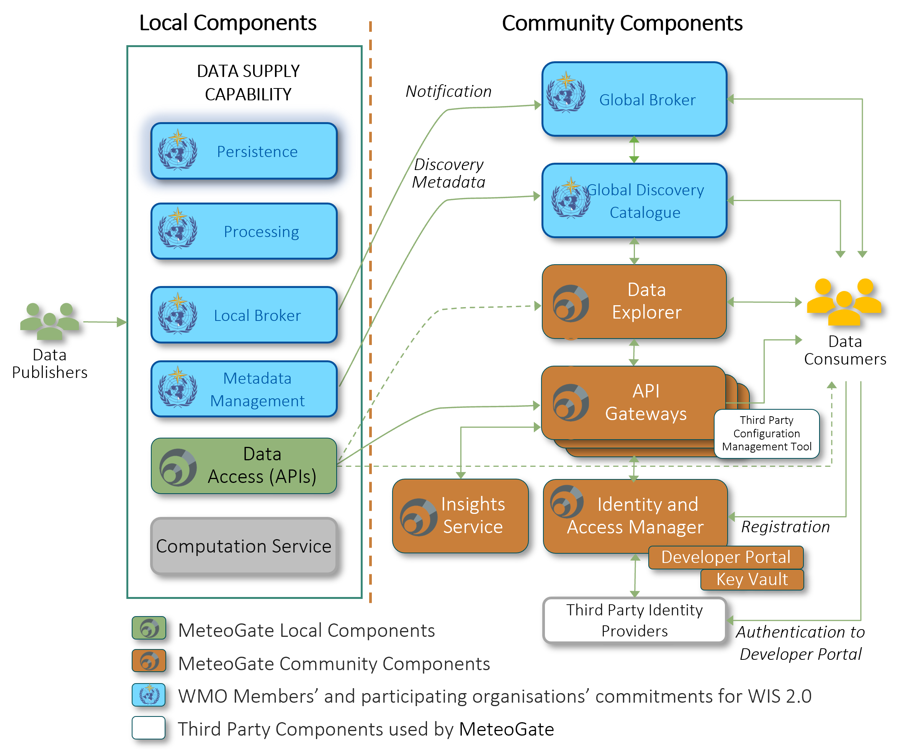

# Architecture

This section provides an overview of the architecture of the MeteoGate system. The page covers:

  - A high-level architecture diagram showing the major components and information flows.
  - A brief description of each Community, Local, WMO WIS 2.0, and Third-Party component.

---

## MeteoGate Components

MeteoGate provides technical infrastructure, underpinned by policies, standards, and processes, which enable data to be discovered and accessed in one place. It follows rules set by the WMO and the data owners, letting people share data without changing who owns it. 

Below is an overview of the technical components and information flows of the MeteoGate solution. It contains a high-level description of the MeteoGate components, how they fit together and what they need to do. Note that in addition to MeteoGate-specific components, MeteoGate utilises Local components, WMO WIS 2.0 components, and Third-Party components.
An overview of the components and information flows is provided in the following diagram. Subsequently, the functionality of each component is described on a high level. The description of information flows is simplified.

### MeteoGate Community Components

#### API Gateways 

API Gateways provide managed access to the data shared through MeteoGate. The API Gateway also collects data on transactions to provide data usage and publishing information through the Insights Service.
API Gateways handle data requests from Data Consumer applications, provide cybersecurity and access control, and proxy access to connected Data Supply services. The API Gateway may need to authenticate users accessing some datasets, as stated in the data policy. The API Gateway uses unique tokens (API Keys) appended to data access requests to identify users. Users must register in the MeteoGate Developer Portal to obtain an API Key.

The API Gateway is a MeteoGate managed service. Data Publishers can choose to register their Data Supply components with the appropriate API Gateway, based on how they have deployed/configured their service, service proximity to the API Gateway, anticipated data volumes, estimated costs, and whether they want to capture metrics or benefit from other capabilities such as rate-limiting and access control.

Selecting the deployment platforms is an architectural decision for MeteoGate, impacted by e.g. where most of the Data Supply services are hosted, and cost matters. API Gateway is currently deployed on EWC as 80 % of EUMETNET Members either do not need API Gateway protection or can be covered by the MeteoGate API Gateway on EWC.
Even though the API Gateway instances are federated, the Data Consumer can use the same API Key at every API Gateway instance. There is a centralised control and configuration process for managing the API Gateway instances.
The API Gateway supports multiple API standards.

#### Data Explorer

Data Explorer is a web application that enables Data Consumers to search and browse the data available through MeteoGate. It also pulls in supplementary information from OSCAR/Surface. The Data Explorer uses metadata and data from both Global Discovery Catalogue and Data Supply components.

#### Identity & Access Manager

Some MeteoGate data policies require that users register before they can access the open data. The Identity & Access Manager administers access to data through MeteoGate Community Components, including Developer Portal and potentially Data Explorer. It also supports federated authentication through trusted Third-Party Identity Providers and includes an internal user repository for storing minimal user data (e.g., username, email) in compliance with GDPR.

#### Key Vault

API Keys issued to registered users are stored securely in the Key Vault.

#### Insights Service
Community Capability Operators and other stakeholders can use the Insights service to monitor data discovery and use. For example, they can observe how the data is passing through the MeteoGate system to be able to address any issues.

### Local Components 

#### Data Supply 

Data Supply is a Local Component in MeteoGate responsible for exposing meteorological and hydrological data, managing metadata, and fulfilling notification requirements. While many of its functions support WMO WIS 2.0 obligations, Data Supply is also a core part of how data is published and made available through MeteoGate.
There are two main types of Data Supply in MeteoGate:

  - HVD Services: Centrally operated services for sharing EU High-Value Datasets (e.g. E-SOH, Radar, Climate).
  - NMHS Data Supplies: Locally maintained by National Meteorological and Hydrological Services.

Data Supply components can be integrated into MeteoGate in three different ways. Publishers may connect to an HVD service, expose APIs through the central MeteoGate API Gateway, or allow direct access to their APIs. See the [Data Publishing guide](./3-publishing-data/) for details.
Each Data Supply shall support the following core capabilities:

  - Data Access: Provides interactive API access to datasets (collections), using MeteoGate-compliant standards such as OGC API – EDR.
  - Data Persistence: Ensures reliable storage of shared data, enabling queryable access by MeteoGate users and systems.
  - Metadata Management: Supports creation, publication, and maintenance of both discovery and provenance metadata. Discovery metadata is published to the WIS2 Global Discovery Catalogue, and changes are communicated via the Global Broker.
  - Notification and Brokering: Acts as a Local Broker to send notifications about new or updated datasets and metadata to the WIS2 Global Broker infrastructure.
  - Data Processing: Applies data formatting, structuring, and validation rules according to WMO regulations and MeteoGate Policies, Standards and Processes (PSPs).

Data Supply implementations can be based on the technology of the Data Publisher’s choice, if they meet interoperability requirements defined by MeteoGate and comply with relevant WMO and EU policies.

### WMO 2.0 Components

#### WMO WIS 2.0 Global Discovery Catalogue

The [Global Discovery Catalogue](https://wmo-im.github.io/wis2-guide/guide/wis2-guide-APPROVED.html#_2_4_4_global_discovery_catalogue) is a web application for data search and discovery, describing data from WIS 2.0 and MeteoGate. It subscribes to notifications from the Global Broker to update discovery metadata. 
The catalogue provides summary descriptions and URLs for accessing shared data via the API Gateway or directly.

#### WMO WIS 2.0 Global Broker

The [Global Broker](https://wmo-im.github.io/wis2-guide/guide/wis2-guide-APPROVED.html#_2_4_2_global_broker) is an application that provides subscription-based notifications about discovery metadata and data changes. It subscribes to notifications from the Data Supply and republishes them to Data Consumer applications. These notifications enable real-time data sharing. WIS 2.0 includes several Global Brokers."

### Third-Party Components

#### Third-Party Identity Providers

MeteoGate doesn't manage passwords or user accounts. The Developer Portal requires users to authenticate via a Third-Party Identity Provider (e.g., Azure AD, Google, GitHub or EUMETNET Member’s IdP service). The Identity Provider supplies limited attributes, such as user identifier and email, to the Identity and Access Manager.

#### Third-Party Configuration Management Tool

MeteoGate administrators use a GitHub Configuration Management Tool to register local Data Supply components and configure API Gateways.
